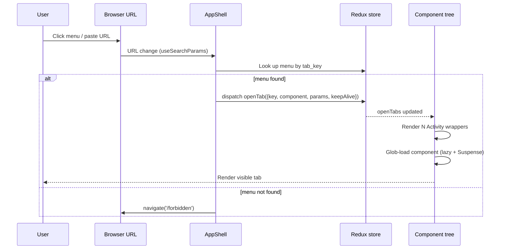

# Soar — FE Admin Architecture Plan

> Master reference document for Soar admin frontend (Phase 5).
> Single source of truth for stack choices, conventions, and architectural patterns.

**Version**: 1.0 (Session S12, 2026-06-05)
**Scope**: Admin panel only (`/admin-api`). App frontend (`/app-api`) and landing portal out of scope.
**Status**: Foundation locked. Implementation pending Phase 5A scaffold.

---

## 0. How to use this document

- **First read**: Sections 1–6 cover the core architecture. Read in order.
- **Reference**: Sections 7–10 are domain-specific deep dives. Jump as needed.
- **Decisions log**: Section 11 lists deferred items and rejected alternatives with reasoning.
- **Quick start**: Appendix B has the folder skeleton; Appendix C lists the BE endpoints FE will consume.

When making future architectural decisions, update this document **first**, then propagate to code/agents.

---

## 1. Stack overview

| Layer             | Choice                                  | Version       | Rationale                                                                                                                             |
| ----------------- | --------------------------------------- | ------------- | ------------------------------------------------------------------------------------------------------------------------------------- |
| Build tool        | Vite                                    | latest (^7)   | De facto standard, fast HMR, native ESM                                                                                               |
| Framework         | React                                   | 19.2+         | `<Activity>` stable component required for tabs view keep-alive                                                                       |
| Compiler          | React Compiler                          | stable        | Auto-memoization; reduces manual `useMemo`/`useCallback`. Via `babel-plugin-react-compiler` + `@rolldown/plugin-babel` in Vite        |
| Language          | TypeScript                              | latest (^6.0) | Type safety across boundaries. `erasableSyntaxOnly` + `verbatimModuleSyntax` enforced                                                 |
| UI library        | Ant Design (antd)                       | v6            | Batteries-included for admin CRUD; matches yudao Element Plus catalog 1:1 conceptually; large component surface                       |
| State (client)    | Redux Toolkit                           | latest        | Predictable global state for auth, menu, tabs, theme                                                                                  |
| State (server)    | TanStack Query                          | v5            | Cache + revalidation + dedupe; pseudo keep-alive via `staleTime`                                                                      |
| Table             | antd Table                              | bundled       | Native antd; `usePagedQuery` helper for paged endpoints                                                                               |
| Form              | antd Form                               | bundled       | Native antd, no `Controller` boilerplate                                                                                              |
| Schema validation | (none baseline)                         | —             | zod/RHF added per-feature only if a specific form demands it                                                                          |
| Router            | react-router-dom                        | v7            | Thin role: login vs main shell split only                                                                                             |
| HTTP client       | axios                                   | latest        | Mature, interceptor model                                                                                                             |
| i18n              | i18next + react-i18next                 | latest        | Key-driven from day 1; default EN, slots for VN/TQ                                                                                    |
| Icons             | @iconify/react                          | latest        | Match yudao seed icon strings (`ep:tools`, `fa:medium`); offline bundle                                                               |
| Date/time         | dayjs                                   | latest        | antd v6 default; timezone plugin                                                                                                      |
| Persist           | redux-persist                           | latest        | Session-scoped persistence for tabs + theme                                                                                           |
| Layout styling    | Tailwind CSS                            | v4            | Utility classes for layout primitives (`div`, `span`, spacing, flex/grid). NOT for theme-aware colors — those go through antd tokens. |
| Dev tools         | Redux DevTools, TanStack Query Devtools | —             | Required in dev mode                                                                                                                  |
| Testing           | Vitest + React Testing Library + MSW    | latest        | Foundation tabs system requires unit + integration tests                                                                              |

### Rejected alternatives

- **shadcn/ui**: rejected as the component library. Strong for bespoke/storefront, weak for reproducing admin patterns quickly. yudao port favors batteries-included (antd). Tailwind itself IS adopted, but only as a utility-class layer for layout primitives (see §8.2).
- **ProComponents (antd Pro)**: rejected. Config-driven, inflexible (Long evaluated ~1 year ago). antd core + thin in-house helpers preferred.
- **TanStack Router**: rejected. Type-safe search params upside is real but small once URL becomes flat (`?tab=...`); learning curve + dynamic routing edge cases outweigh benefit. See Section 11.
- **react-hook-form + zod (eager)**: rejected as default. Wrapping `Controller` around every antd input adds 5–7 lines per field. Added per-feature only.
- **lucide-react / antd Icons**: rejected as primary. yudao seed uses Iconify strings; matching avoids icon string remapping.

---

## 2. Project structure

Inspired by `acc-logistic-rmk-fe`. Feature-based with thin wrappers.

```
src/
├── app/                        # Application infrastructure
│   ├── store.ts                # Redux store + persist config
│   ├── query-client.ts         # TanStack Query client config
│   ├── providers.tsx           # Composed providers: <ReduxProvider><QueryClientProvider><ConfigProvider><I18nProvider>...
│   └── slices/
│       ├── auth.slice.ts       # user, accessToken, refreshToken, expiresTime
│       ├── menu.slice.ts       # flat list + tree of menus (loaded from /get-permission-info)
│       ├── tabs.slice.ts       # openTabs + activeTabId (persisted to sessionStorage)
│       └── theme.slice.ts      # mode: 'light' | 'dark'
│
├── shared/                     # Cross-cutting, reusable
│   ├── api/
│   │   ├── http-client.ts      # axios instance
│   │   ├── interceptors/
│   │   │   ├── tenant-interceptor.ts    # add tenant-id header
│   │   │   ├── auth-interceptor.ts      # add Authorization header
│   │   │   └── error-interceptor.ts     # unwrap CommonResult, single-flight refresh on 401
│   │   └── types.ts            # CommonResult<T>, PageResult<T>, PageParam
│   ├── components/
│   │   ├── HasPermission.tsx   # permission-gated rendering
│   │   ├── DictTag.tsx         # render dict label with color
│   │   ├── DictSelect.tsx      # antd Select bound to dict type
│   │   ├── TreeSelect.tsx      # antd TreeSelect (dept tree, etc.)
│   │   └── PageNotFound.tsx
│   ├── hooks/
│   │   ├── useDict.ts          # load + cache dict data
│   │   ├── usePagedQuery.ts    # TanStack Query wrapper for paged list endpoints
│   │   └── usePermission.ts    # hasPermission(code), wildcard-aware
│   ├── lib/
│   │   ├── env.ts              # parse + validate import.meta.env
│   │   ├── tenant.ts           # getTenantId(), setTenantId()
│   │   ├── token.ts            # getAccessToken(), setToken(), getRefreshToken()
│   │   ├── format.ts           # formatDate, formatDateTime
│   │   └── permission-matcher.ts  # hasPermission helper with wildcard
│   └── i18n/
│       ├── config.ts
│       └── locales/
│           ├── en.json
│           ├── vi.json
│           └── zh-CN.json
│
├── features/                   # Business code by domain
│   ├── system/
│   │   ├── user/
│   │   │   ├── api/index.ts         # user.api.ts: list, get, create, update, delete, ...
│   │   │   ├── types.ts             # UserListItemDTO, UserDetailDTO, UserCreateReqDTO, ...
│   │   │   ├── components/
│   │   │   │   ├── user-list-page.tsx
│   │   │   │   ├── user-detail-page.tsx
│   │   │   │   ├── user-form-modal.tsx
│   │   │   │   └── user-search-form.tsx
│   │   │   ├── hooks/
│   │   │   │   └── useUserList.ts
│   │   │   └── index.ts             # public exports
│   │   ├── role/
│   │   ├── dept/
│   │   ├── dict/
│   │   ├── menu/
│   │   ├── tenant/
│   │   └── ...
│   ├── infra/
│   │   ├── api-log/
│   │   ├── file/
│   │   └── ...
│   └── auth/                        # login, callback, profile
│
├── pages/                          # Thin wrappers — entry points for menu navigation
│   ├── system/
│   │   ├── user/
│   │   │   ├── index.tsx            # ~10 lines: useDocumentTitle + <UserListPage />
│   │   │   └── detail.tsx           # detail page
│   │   ├── role/
│   │   │   └── index.tsx
│   │   └── ...
│   ├── infra/
│   ├── login.tsx                    # not menu — entry for unauthenticated
│   ├── forbidden.tsx
│   └── not-found.tsx
│
├── layouts/
│   ├── AppShell.tsx                 # main shell: Sider + Header + TabBar + Content
│   ├── BlankLayout.tsx              # for login, forbidden, not-found
│   └── components/
│       ├── SiderMenu.tsx
│       ├── TabBar.tsx
│       ├── HeaderBar.tsx
│       └── TabRenderer.tsx          # resolves menu.component → glob-loaded component
│
└── routes/
    ├── index.tsx                    # top-level <BrowserRouter> + <Routes>
    └── guards/
        ├── AuthGuard.tsx            # check logged in
        └── PermissionGuard.tsx      # (optional) check menu permission for tab_key
```

### Key conventions

- **Three-layer separation**:
  - `pages/` = thin wrappers (~10 lines each) that map to `system_menu.component` strings. Sole purpose: be discoverable by `import.meta.glob('/src/pages/**/*.tsx')`.
  - `features/` = business code (components, hooks, API calls, types).
  - `shared/` = cross-cutting infrastructure (HTTP, hooks, utils).
- **Page wrappers are dispatchers, not logic holders.** Move logic to `features/`.
- **Imports flow from `features/` and `pages/` into `shared/`, never the reverse.** Use ESLint `no-restricted-imports` or `eslint-plugin-boundaries` if desired.
- **File naming**: kebab-case (`user-list-page.tsx`, `dict-select.tsx`). React component names PascalCase inside the file.
- **One feature per folder**, even small ones. No `misc/` or `utils/` dumping grounds inside `features/`.

---

## 3. URL pattern and routing strategy

### 3.1 Design choice: flat URL with query params

```
/?tab=system-user
/?tab=system-user&pageNo=2&status=1
/?tab=system-user-detail&id=42
/?tab=infra-job-log&jobId=5&pageNo=3
```

URL structure: `/?tab=<tab_key>&<arbitrary params>`

- `tab` = dispatcher key (== `system_menu.tab_key`).
- All other params are passed to the rendered component via context.
- No path-based routing for menu content. Single root path `/`.

### 3.2 Why this pattern (not yudao path-based)

React ecosystem disparity vs Vue:

| Concern                                      | Vue ecosystem (yudao)                                             | React ecosystem (Soar)                                                                                          |
| -------------------------------------------- | ----------------------------------------------------------------- | --------------------------------------------------------------------------------------------------------------- |
| Dynamic routes from runtime data (menu tree) | `router.addRoute(parent, routeRecord)` — native, mature ~10 years | No equivalent native API; must recreate router or hack JSX `<Routes>` children                                  |
| Keep-alive on route switch                   | `<keep-alive>` + `<router-view v-slot>` — first-class since Vue 2 | `<Activity>` stable only since Oct 2025 (React 19.2); no router integration; deviation from `<Outlet>` required |

Adopting yudao's path-based URLs in React forces two simultaneous workarounds (dynamic route creation + non-standard outlet rendering). Switching to flat URL + query params eliminates both problems:

- **Dynamic route problem disappears**: there is no route tree to extend at runtime. There is one root path. Component selection happens via lookup `tab_key → component path` then `import.meta.glob` loader. The "route table" is the menu data already returned by BE.
- **Outlet problem disappears**: there is nothing to outlet. AppShell renders N tabs from Redux state directly, each one wrapped in `<Activity>`. No router driver in the main content area.

Inspired by: Accton PLM (https://accplm.accton.com) — server-driven UI workflow using `?tab=...` URL pattern. We adopt the URL convention without the full server-driven-UI generic renderer (Soar uses per-entity components like yudao).

### 3.3 Router role

`react-router-dom` v7 retained but plays a **thin role**:

```tsx
<BrowserRouter>
  <Routes>
    <Route path="/login" element={<LoginPage />} />
    <Route path="/forbidden" element={<ForbiddenPage />} />
    <Route
      path="/*"
      element={
        <AuthGuard>
          <AppShell />
        </AuthGuard>
      }
    />
  </Routes>
</BrowserRouter>
```

- 3 top-level routes (login, forbidden, main shell).
- No `<Outlet>` inside `AppShell` for menu content. Tabs render directly from Redux state.
- Browser back/forward, deep-link sharing, F5 — all work via standard URL semantics on the single root path with search params.

### 3.4 What we lose by deviating

- React Router data API (`loader`, `action`, `useNavigation` per route) — replaced by TanStack Query (using either way).
- Route-level `<Outlet>` nesting for sub-pages within a feature — replaced by antd `<Tabs>` if needed inside a page (the common pattern anyway).
- Onboarding: codebase is "tabs-aware"; not standard react-router idiom. Mitigated by this document + agents/fe rules.

---

## 4. Schema changes (BE)

Migration `V1_0_8__add_tab_key_to_system_menu.sql`:

```sql
ALTER TABLE system_menu ADD COLUMN tab_key VARCHAR(100);

CREATE UNIQUE INDEX system_menu_tab_key_uk
  ON system_menu (tab_key)
  WHERE tab_key IS NOT NULL AND deleted = false;

COMMENT ON COLUMN system_menu.path IS
  'DEPRECATED since V1_0_8. Kept for yudao seed import compatibility. Use tab_key for FE routing.';

COMMENT ON COLUMN system_menu.component_name IS
  'DEPRECATED since V1_0_8. Vue-specific (keep-alive registry). React does not need.';

COMMENT ON COLUMN system_menu.keep_alive IS
  'Used by FE to wrap route in <Activity> (React 19.2). Same semantic as Vue keep-alive.';
```

### 4.1 Field semantics after V1_0_8

| Field             | Role                                       | Notes                                                   |
| ----------------- | ------------------------------------------ | ------------------------------------------------------- |
| `id`, `parent_id` | Tree structure                             | —                                                       |
| `name`            | Display label                              | i18n key in future; raw text for now                    |
| `type`            | 1=Directory, 2=Menu, 3=Button              | See 4.2                                                 |
| `sort`            | Display order                              | —                                                       |
| `permission`      | Permission code (e.g., `system:user:list`) | Used by BE `@PreAuthorize` and FE `<HasPermission>`     |
| `tab_key`         | URL dispatcher key (NEW)                   | Required when `type=2`; null otherwise                  |
| `component`       | FE file path (e.g., `system/user/index`)   | Required when `type=2`; resolved via `import.meta.glob` |
| `path`            | DEPRECATED                                 | Kept for yudao seed import; FE ignores                  |
| `component_name`  | DEPRECATED                                 | Vue-only; React ignores                                 |
| `icon`            | Iconify string (e.g., `ep:tools`)          | Rendered by `@iconify/react`                            |
| `visible`         | Show in sidebar?                           | type=2 + visible=false = hidden page (detail/edit)      |
| `keep_alive`      | Wrap in `<Activity>`?                      | Controls tab state preservation                         |
| `always_show`     | Always show parent even if single child    | Display hint                                            |
| `status`          | Enabled/disabled                           | —                                                       |

### 4.2 Menu type matrix

| type          | visible | tab_key  | component | In sidebar?          | Renders page?             | Permission check                |
| ------------- | ------- | -------- | --------- | -------------------- | ------------------------- | ------------------------------- |
| 1 (Directory) | true    | NULL     | NULL      | Yes (groups submenu) | No (expand/collapse only) | —                               |
| 2 (Menu page) | true    | REQUIRED | REQUIRED  | Yes                  | Yes                       | Yes                             |
| 2 (Menu page) | false   | REQUIRED | REQUIRED  | **No** (hidden)      | Yes (deep link only)      | Yes                             |
| 3 (Button)    | (n/a)   | NULL     | NULL      | No                   | No                        | Yes — gates UI buttons in pages |

### 4.3 `tab_key` naming convention

**Format**: `<module>-<entity>[-<action>]`

- Lowercase ASCII letters, digits, hyphens only.
- No slashes, dots, colons.
- Maximum 100 chars (DB limit).
- Globally unique among `tab_key NOT NULL` rows (partial unique index).
- Action suffix only when distinguishing from list: list page = no suffix; detail/edit/log = with suffix.

**Examples for Soar core**:

| Menu purpose                  | tab_key                 | component                     | visible                               |
| ----------------------------- | ----------------------- | ----------------------------- | ------------------------------------- |
| User Management (list)        | `system-user`           | `system/user/index`           | true                                  |
| User Detail                   | `system-user-detail`    | `system/user/detail`          | false                                 |
| Role Management               | `system-role`           | `system/role/index`           | true                                  |
| Role Detail                   | `system-role-detail`    | `system/role/detail`          | false                                 |
| Dept Management               | `system-dept`           | `system/dept/index`           | true                                  |
| Menu Management               | `system-menu`           | `system/menu/index`           | true                                  |
| Dict Type                     | `system-dict-type`      | `system/dict/type/index`      | true                                  |
| Dict Data                     | `system-dict-data`      | `system/dict/data/index`      | false (opens with `dictType=X` param) |
| Tenant Management             | `system-tenant`         | `system/tenant/index`         | true                                  |
| Tenant Package                | `system-tenant-package` | `system/tenant/package/index` | true                                  |
| Login Log                     | `system-login-log`      | `system/loginlog/index`       | true                                  |
| Operate Log                   | `system-operate-log`    | `system/operatelog/index`     | true                                  |
| User Profile (top-right menu) | `user-profile`          | `user-profile/index`          | false                                 |
| API Access Log                | `infra-api-access-log`  | `infra/apilog/access/index`   | true                                  |
| API Error Log                 | `infra-api-error-log`   | `infra/apilog/error/index`    | true                                  |
| Job Manager                   | `infra-job`             | `infra/job/index`             | true                                  |
| Job Log                       | `infra-job-log`         | `infra/job/log/index`         | false                                 |
| Config Manager                | `infra-config`          | `infra/config/index`          | true                                  |
| File Manager                  | `infra-file`            | `infra/file/index`            | true                                  |
| File Config                   | `infra-file-config`     | `infra/file/config/index`     | true                                  |

Full menu seed mapping will live in `BE_Spec_V1_0_8_Changes.md`.

### 4.4 Hidden menu rationale

Detail/Edit pages are `type=2, visible=false` (not `type=3`). Reasoning:

- They are **pages** that render — must have `tab_key` and `component`.
- They need permission gating identical to visible pages.
- Deep link sharing requires them to be addressable: `https://soar.com/?tab=system-user-detail&id=42`.

Button-level permission gating (e.g., the "Edit" button in the user list) uses `type=3` permission nodes with codes like `system:user:update`. The button's permission code typically matches the corresponding hidden menu's permission code.

---

## 5. BE contract (FE consumes)

### 5.1 Response envelope

```ts
interface CommonResult<T> {
  code: number // 0 = success, anything else = error
  msg: string // human-readable error message; localized server-side
  data: T
}

interface PageResult<T> {
  total: number // total row count (across all pages)
  list: T[] // rows for current page
}

interface PageParam {
  pageNo: number // 1-based
  pageSize: number // default 10
}
```

Response interceptor (in `error-interceptor.ts`):

1. Unwrap `CommonResult` when `code === 0` → resolve with `data`.
2. When `code !== 0`:
   - `code === 401` → trigger refresh flow (see 7.1).
   - Otherwise → reject with `Error(msg)`.

### 5.2 Auth endpoints

```
POST /admin-api/system/auth/login
  Body:  { username, password, captchaVerification? }
  Headers: tenant-id required
  Response: { userId, accessToken, refreshToken, expiresTime }

POST /admin-api/system/auth/logout
  Headers: Authorization Bearer
  Response: empty

POST /admin-api/system/auth/refresh-token?refreshToken=<token>
  Note: refreshToken is a query parameter, not body
  Response: { userId, accessToken, refreshToken, expiresTime }

GET /admin-api/system/auth/get-permission-info
  Headers: Authorization Bearer, tenant-id
  Response: {
    user: { id, nickname, avatar, deptId, username, email },
    roles: string[],         // role codes
    permissions: string[],   // permission codes; ['*:*:*'] for super admin
    menus: MenuDTO[],        // tree, server-filtered by permissions
  }
```

### 5.3 MenuDTO

```ts
interface MenuDTO {
  id: number
  parentId: number
  name: string
  type: 1 | 2 | 3 // 1=Directory, 2=Page, 3=Button
  sort: number
  permission: string | null // permission code; null for type=1 directories
  tabKey: string | null // NEW; required when type=2
  component: string | null // FE file path; required when type=2
  icon: string | null // Iconify string e.g., 'ep:tools'
  visible: boolean
  keepAlive: boolean
  alwaysShow: boolean
  children: MenuDTO[] // null if leaf
}
```

### 5.4 Tenant endpoints (new in V1_0_8, see BE Spec)

```
GET /admin-api/system/tenant/get-id-by-name?name=<tenant name>
  @PermitAll, @TenantIgnore
  Response: Long (tenant id) or 404

GET /admin-api/system/tenant/get-by-website?website=<website>
  @PermitAll, @TenantIgnore
  Response: { id, name } or 404
```

Both endpoints required to be reachable WITHOUT a `tenant-id` header (chicken-and-egg). `@TenantIgnore` enrolls the endpoint into `TenantSecurityWebFilter.ignoreUrls`.

### 5.5 List endpoint contract pattern

All paged list endpoints follow this shape:

```
GET /admin-api/<module>/<entity>/page?pageNo=1&pageSize=10&<filters>
  Response: CommonResult<PageResult<T>>

GET /admin-api/<module>/<entity>/get?id=<id>
  Response: CommonResult<T>

POST /admin-api/<module>/<entity>/create
  Body: TCreateReqDTO
  Response: CommonResult<id>

PUT /admin-api/<module>/<entity>/update
  Body: TUpdateReqDTO (includes id)
  Response: CommonResult<Boolean>

DELETE /admin-api/<module>/<entity>/delete?id=<id>
  Response: CommonResult<Boolean>
```

Action-path style (not REST). Soar inherits this from yudao.

---

## 6. Tabs view architecture

### 6.1 Conceptual model

Three pieces:

```
┌──────────────┐     ┌──────────────┐     ┌──────────────────┐
│     URL      │ ──▶ │   Redux      │ ──▶ │  Component tree  │
│ ?tab=X&...   │     │  tabs slice  │     │  (Activity x N)  │
└──────────────┘     └──────────────┘     └──────────────────┘
       ▲                    │
       └────────────────────┘
       navigate() updates URL on tab click
```

- **URL**: single source of truth for the **active** tab. Browser history, deep links, F5 all hinge on URL.
- **Redux `tabs` slice**: state for **all open tabs**. Persisted to sessionStorage. Reducers are pure functions.
- **Component tree**: rendered from Redux state. N `<Activity>` wrappers, only the active one visible.

### 6.2 Full flow



### 6.3 Redux state shape

```ts
interface TabRecord {
  id: string // dedup key: `${tabKey}#${stableHash(params)}`
  tabKey: string // 'system-user', 'system-user-detail'
  component: string // 'system/user/index' — for glob loader
  label: string // 'User Management' — displayed in tab bar
  params: Record<string, string>
  keepAlive: boolean
  affixed?: boolean // true for pinned tabs (e.g., Home/Dashboard)
}

interface TabsState {
  openTabs: TabRecord[]
  activeTabId: string | null
}
```

### 6.4 Reducers

```ts
// Idempotent: existing tab is reactivated, not duplicated unless params hash differs
openTab(payload: Omit<TabRecord, 'id'>)

// Standard close operations
closeTab(id: string)
closeOthers(id: string)        // keep id + affixed
closeLeft(id: string)
closeRight(id: string)
closeAll()                     // keep affixed
refreshTab(id: string)         // force remount via key change

// Activation
setActive(id: string)

// Hydrate from URL (idempotent)
hydrateFromUrl({ tabKey, params })
```

### 6.5 Render mechanism

```tsx
// /src/layouts/AppShell.tsx

const pageModules = import.meta.glob('/src/pages/**/*.tsx')

function AppShell() {
  const dispatch = useAppDispatch()
  const [searchParams] = useSearchParams()
  const menus = useAppSelector(s => s.menu.flatList)
  const { openTabs, activeTabId } = useAppSelector(s => s.tabs)

  // URL → Redux (one-way bind)
  useEffect(() => {
    const tabKey = searchParams.get('tab')
    if (!tabKey) {
      // No tab in URL: maybe go to dashboard or first affixed tab
      const home = openTabs.find(t => t.affixed)
      if (home) dispatch(tabsSlice.setActive(home.id))
      return
    }
    const menu = menus.find(m => m.tabKey === tabKey)
    if (!menu) {
      navigate('/forbidden')
      return
    }
    const params = paramsFromSearch(searchParams) // strip 'tab', rest is params
    dispatch(
      tabsSlice.openTab({
        tabKey,
        component: menu.component!,
        label: menu.name,
        params,
        keepAlive: menu.keepAlive,
      }),
    )
  }, [searchParams, menus])

  return (
    <Layout>
      <Sider>
        <SiderMenu />
      </Sider>
      <Layout>
        <Header>
          <TabBar />
        </Header>
        <Content>
          {openTabs.map(tab => {
            const isActive = tab.id === activeTabId
            const node = <TabRenderer tab={tab} />
            return tab.keepAlive ? (
              <Activity key={tab.id} mode={isActive ? 'visible' : 'hidden'}>
                {node}
              </Activity>
            ) : isActive ? (
              <Fragment key={tab.id}>{node}</Fragment>
            ) : null
          })}
        </Content>
      </Layout>
    </Layout>
  )
}

function TabRenderer({ tab }: { tab: TabRecord }) {
  const Component = useMemo(() => {
    const filePath = `/src/pages/${tab.component}.tsx`
    const loader = pageModules[filePath]
    if (!loader) return PageNotFoundFallback
    return lazy(loader as () => Promise<{ default: ComponentType }>)
  }, [tab.component])

  return (
    <Suspense fallback={<Spin />}>
      <TabParamsContext.Provider value={tab.params}>
        <Component />
      </TabParamsContext.Provider>
    </Suspense>
  )
}

// Page consumes:
function UserListPage() {
  const params = useContext(TabParamsContext)
  const pageNo = Number(params.pageNo ?? 1)
  // ...
}
```

### 6.6 Edge cases

| Case                                                         | Behavior                                                                           |
| ------------------------------------------------------------ | ---------------------------------------------------------------------------------- |
| User opens menu A, closes A, presses browser back            | Re-open A (idempotent reducer adds it back)                                        |
| F5 (reload)                                                  | Tabs persisted to sessionStorage hydrate on mount; URL's tab activates             |
| Open new browser tab (Chrome)                                | New Redux instance, independent openTabs (sessionStorage is per-tab)               |
| Open `?tab=X&id=1` then `?tab=X&id=2` from another deep link | Two separate tab records (dedup key includes params hash); label gets `(2)` suffix |
| Open URL for tab_key not in user's menus                     | `navigate('/forbidden')`                                                           |
| Open URL for unknown tab_key                                 | Same as above (menu lookup misses)                                                 |
| keepAlive=false tabs                                         | Mount only when active; unmount on switch away                                     |
| Tab with active form, user switches tab                      | Form state preserved if `keepAlive=true` (via Activity); lost if false             |
| Affixed tab close attempt                                    | `closeTab` no-op; UI hides close button                                            |

### 6.7 Three-phase implementation

Risk-reducing phased delivery (see Section 11.1 for full reasoning):

**Phase 5A — Foundation, no tabs UI**

- Scaffold + react-router shell + axios + login + dispatch loop.
- URL → Redux → render works; openTabs has at most 1 entry; no tab bar.
- Verify: glob loader HMR, antd v6 + React 19.2, refresh token flow.

**Phase 5B — Tab bar UI, no keep-alive**

- Tab bar component + right-click menu (Close / Close Others / etc.).
- Multiple openTabs supported; switch tab = navigate URL = activate from Redux.
- Tabs **without** `<Activity>` — switching unmounts/remounts.
- ~70% of yudao tabs view UX.

**Phase 5C — Keep-alive retrofit**

- Wrap with `<Activity>` per `keepAlive` flag.
- Verify: antd Modal + Activity hidden interaction, TanStack Query observers, focus/scroll.
- If blockers surface → stay at Phase 5B; defer `react-activation` evaluation.

---

## 7. Auth and permission

### 7.1 Token flow

**Login**:

```
POST /system/auth/login → { accessToken, refreshToken, expiresTime }
```

Tokens stored in `localStorage` (keys: `soar_access_token`, `soar_refresh_token`, `soar_expires_time`). Opaque UUID — FE cannot decode. Identity comes from `/get-permission-info`, never from the token.

**Single-flight refresh on 401**:

Pattern ported from yudao `service.ts`:

```ts
// Module-level state (per axios instance, per browser tab)
let isRefreshing = false
let requestQueue: Array<() => void> = []

axios.interceptors.response.use(
  res => res,
  async error => {
    if (error.response?.status !== 401) throw error
    const config = error.config

    if (!isRefreshing) {
      isRefreshing = true
      try {
        if (!getRefreshToken()) return logout()
        const newToken = await refreshTokenApi()
        setToken(newToken)
        // Replay queued requests
        requestQueue.forEach(cb => cb())
        // Retry the current request
        config.headers.Authorization = `Bearer ${newToken.accessToken}`
        return axios(config)
      } catch {
        requestQueue.forEach(cb => cb()) // unblock waiters (they will fail)
        return logout()
      } finally {
        requestQueue = []
        isRefreshing = false
      }
    } else {
      // Refresh already in flight — queue this request
      return new Promise(resolve => {
        requestQueue.push(() => {
          config.headers.Authorization = `Bearer ${getAccessToken()}`
          resolve(axios(config))
        })
      })
    }
  },
)
```

**Logout**: clear tokens, clear Redux (`auth`, `menu`, `tabs`, but keep `theme`), navigate to `/login`. Optionally call BE `/logout` to invalidate server-side (best-effort).

### 7.2 Permission model

**Code-based, with wildcard for super admin**:

- Each `system_menu` row (and standalone button menu) has a `permission` field (e.g., `system:user:list`).
- BE returns `permissions: string[]` to FE via `/get-permission-info`.
- For **super admin** (role id 1), BE short-circuits and returns `permissions: ['*:*:*']`.

**FE check**:

```ts
// shared/lib/permission-matcher.ts
export function hasPermission(required: string, userPerms: string[]): boolean {
  if (userPerms.includes('*:*:*')) return true
  return userPerms.includes(required)
}

// shared/hooks/usePermission.ts
export function usePermission() {
  const perms = useAppSelector(s => s.auth.permissions)
  return useCallback((code: string) => hasPermission(code, perms), [perms])
}

// shared/components/HasPermission.tsx
export function HasPermission({ code, children, fallback = null }: Props) {
  const can = usePermission()
  return can(code) ? <>{children}</> : <>{fallback}</>
}
```

**BE action item (verify)**: confirm `PermissionServiceImpl.getPermissionInfo()` returns `['*:*:*']` for super admin. If not present, add:

```java
if (roleIds.contains(RoleConstants.SUPER_ADMIN_ID)) {
  return Set.of("*:*:*")
}
```

### 7.3 Multi-layer permission check

| Layer                                          | Check                           | Effect if denied      |
| ---------------------------------------------- | ------------------------------- | --------------------- |
| `<AuthGuard>` (router)                         | User logged in?                 | Redirect `/login`     |
| AppShell URL → menu lookup                     | Is `tab_key` in user's menus?   | Navigate `/forbidden` |
| `<HasPermission code="...">`                   | Has specific button permission? | Hide button           |
| BE `@PreAuthorize("@ss.hasPermission('...')")` | Final source of truth           | 403 response          |

Defense in depth: bypassing FE by typing URL in browser still fails at the menu lookup layer (menu not in filtered list) and the BE layer.

### 7.4 Tenant-id flow

**Initial state**: env var `VITE_DEFAULT_TENANT_ID=1` (defaults to single-tenant).

**Helper**:

```ts
// shared/lib/tenant.ts
const STORAGE_KEY = 'soar_tenant_id'

export function getTenantId(): string {
  const stored = localStorage.getItem(STORAGE_KEY)
  if (stored) return stored
  return import.meta.env.VITE_DEFAULT_TENANT_ID ?? '1'
}

export function setTenantId(id: string): void {
  localStorage.setItem(STORAGE_KEY, id)
}
```

**Axios interceptor**:

```ts
// shared/api/interceptors/tenant-interceptor.ts
export function tenantInterceptor(config: AxiosRequestConfig) {
  config.headers['tenant-id'] = getTenantId()
  return config
}
```

**Always sent**. BE `TenantSecurityWebFilter` requires the header on every URL except those in `ignoreUrls` (currently empty) or those annotated `@TenantIgnore`. **Login is NOT `@TenantIgnore`** — header required even at login.

**Multi-tenant future (Option B)**: when multi-tenant deployment matures, add a "Tenant code" input to the login page → call `GET /system/tenant/get-id-by-name?name=...` → `setTenantId(id)` → proceed to login. The two new BE endpoints (`/get-id-by-name`, `/get-by-website`) make this seamless without further BE work.

---

## 8. Cross-cutting concerns

### 8.1 i18n

- Library: `i18next` + `react-i18next`.
- Default locale: `en`. Slots prepared: `vi`, `zh-CN`.
- Storage: `localStorage` key `soar_locale`. Defaults to browser locale if matches available, else `en`.
- Key structure (flat, dot-separated, namespaced by feature):
  ```json
  {
    "common.cancel": "Cancel",
    "common.confirm": "OK",
    "system.user.title": "User Management",
    "system.user.field.username": "Username"
  }
  ```
- antd locale: change with `<ConfigProvider locale={...}>` based on current i18n language (load `import enUS from 'antd/locale/en_US'` etc.).
- **No hardcoded strings in JSX** (linter rule recommended).

### 8.2 Styling layers — Tailwind + antd token split

Two complementary systems with a clear boundary. **No overlap allowed**.

**Tailwind v4 (utility classes)** — for HTML primitives and layout:

- Spacing: `p-4`, `mt-2`, `gap-3`
- Sizing: `w-full`, `max-w-md`, `min-h-screen`
- Flex/grid: `flex`, `items-center`, `justify-between`, `grid`, `grid-cols-2`
- Layout positioning: `relative`, `absolute`, `top-0`, `z-10`
- Display: `block`, `hidden`, `inline-flex`
- Responsive breakpoints: `md:flex-row`, `lg:max-w-4xl`
- Border radius: `rounded-md`, `rounded-full`
- Border/divider: `border`, `border-b`
- Font size + weight (NON-theme-aware): `text-sm`, `font-medium`

**antd tokens** — for theme-aware properties:

- Colors: `colorPrimary`, `colorText`, `colorBgContainer`, `colorBorder`
- Component-level styling (Button variants, Card padding via theme)
- Dark mode adaptation: `<ConfigProvider theme={{ algorithm: ... }}>` switches all tokens at once

**Why split this way**: Tailwind utility classes are static — `bg-blue-500` doesn't change in dark mode. antd tokens flip automatically. Putting colors in Tailwind breaks dark mode. Putting spacing in tokens means verbose inline styles for every layout.

**Concrete rules**:

```tsx
// ✅ GOOD — Tailwind for layout, antd token for theme-aware color
<div className="flex items-center gap-2 p-4">
  <Button type="primary">Save</Button>
  <span style={{ color: token.colorTextSecondary }}>Hint text</span>
</div>

// ✅ GOOD — Tailwind on wrapper, antd component handles itself
<div className="grid grid-cols-2 gap-4">
  <Card title="Left">...</Card>
  <Card title="Right">...</Card>
</div>

// ❌ BAD — Tailwind color won't react to dark mode
<div className="bg-white text-gray-900">...</div>

// ❌ BAD — antd className override fights antd's internal styles
<Button className="bg-red-500">Don't</Button>
// Use antd's `danger` prop or theme override instead:
<Button danger>Do this</Button>

// ❌ BAD — verbose inline style for what Tailwind solves cleanly
<div style={{ display: 'flex', alignItems: 'center', gap: 8, padding: 16 }}>...</div>
// Use: <div className="flex items-center gap-2 p-4">...</div>
```

**Hard rules**:

- No hex/rgb color literals anywhere (not in CSS, not in `style={}`, not in Tailwind via arbitrary values like `bg-[#fff]`).
- No `text-blue-500`, `bg-gray-100`, or any Tailwind color class on theme-sensitive elements.
- No magic spacing in inline `style` — use Tailwind utilities (`p-4`, `gap-2`) or antd component padding.
- No `className` on antd components for visual styling — use antd props or `ConfigProvider` theme overrides.
- No custom CSS files unless absolutely necessary (e.g., one-off animation Tailwind can't express).

**Theme mode**: `themeSlice.mode: 'light' | 'dark'` in Redux, persisted to `localStorage` (key `soar_theme`). `ConfigProvider` switches antd `algorithm`. Tailwind dark mode is not used (Tailwind colors are not theme-aware in Soar's setup).

Toggle button: deferred to Phase 5B; theme infrastructure scaffolded from day 1.

### 8.3 TanStack Query defaults

```ts
const queryClient = new QueryClient({
  defaultOptions: {
    queries: {
      staleTime: 5 * 60_000, // 5 min — key for tab switch UX
      gcTime: 30 * 60_000, // 30 min cache before GC
      retry: 1, // 1 retry for 5xx
      refetchOnWindowFocus: false, // admin doesn't need
      refetchOnReconnect: 'always',
    },
    mutations: {
      retry: 0, // no auto-retry for mutations (prevent double-submit)
    },
  },
})
```

Query key convention: arrays with feature namespace.

```ts
// Good
;['user', 'list', { pageNo, pageSize, status }][('user', 'detail', userId)][
  ('dict', 'data', dictType)
][
  // Bad
  ('/api/system/user/page', params)
] // don't bake URL into key
```

### 8.4 Date/time format

- All BE timestamps are `Instant` (UTC).
- FE display format: `YYYY-MM-DD HH:mm:ss [GMT]Z`, e.g., `2025-12-01 14:30:00 GMT+07:00`.
- `Z` is the dynamic timezone offset (browser local). If a customer requests forced VN timezone, change one line: `dayjs.tz.setDefault('Asia/Ho_Chi_Minh')`.

```ts
// shared/lib/format.ts
import dayjs from 'dayjs'
import utc from 'dayjs/plugin/utc'
import timezone from 'dayjs/plugin/timezone'

dayjs.extend(utc)
dayjs.extend(timezone)

const DATETIME_FORMAT = 'YYYY-MM-DD HH:mm:ss [GMT]Z'
const DATE_FORMAT = 'YYYY-MM-DD'

export function formatDateTime(instant: string | undefined): string {
  if (!instant) return ''
  return dayjs(instant).format(DATETIME_FORMAT)
}

export function formatDate(instant: string | undefined): string {
  if (!instant) return ''
  return dayjs(instant).format(DATE_FORMAT)
}
```

### 8.5 Icons

- Library: `@iconify/react`.
- Mode: **offline bundle** (production), online (dev OK).
- Setup: install `@iconify/json` (full catalog) or per-set packages (`@iconify-icons/ep`, etc.).
- Match yudao seed strings: `ep:tools`, `fa:medium`, `simple-icons:civicrm`, etc.
- Component wrapper:
  ```tsx
  import { Icon } from '@iconify/react'
  export function MenuIcon({ name }: { name: string }) {
    return <Icon icon={name} width={16} height={16} />
  }
  ```

### 8.6 Error handling

- **Network/HTTP errors**: caught in axios error interceptor, surfaced via antd `message.error(msg)`.
- **Component crashes**: top-level `<ErrorBoundary>` (use `react-error-boundary`) wrapping AppShell. Per-tab error boundary inside `TabRenderer` (so one tab crash doesn't take down the shell).
- **Unhandled promise rejections**: window-level listener, log to console + (future) telemetry.

### 8.7 Loading states

- **Page-level**: `Suspense` fallback `<Spin />` while glob-loaded component fetches.
- **Data-level**: TanStack Query `isLoading` → table `loading` prop on antd Table.
- **Action-level**: button `loading` prop bound to mutation `isPending`.
- **Global**: avoid global spinner (yudao uses NProgress; we skip — page/action-level is enough).

### 8.8 React Compiler

Soar enables React Compiler in the Vite pipeline via `@rolldown/plugin-babel` + `babel-plugin-react-compiler` + `reactCompilerPreset` from `@vitejs/plugin-react`. Compiler runs at build time, transforming components to auto-memoize values and JSX.

**Practical implications**:

- **Trust the compiler — drop manual memoization by default.** Don't wrap callbacks in `useCallback` or values in `useMemo` "for performance". The compiler does this better than you can. Write straightforward code:

  ```tsx
  // ✅ Idiomatic with React Compiler
  function UserList() {
    const [keyword, setKeyword] = useState('')
    const filtered = users.filter(u => u.name.includes(keyword)) // RC auto-memoizes
    return <Table dataSource={filtered} onSearch={value => setKeyword(value)} /> // RC auto-memoizes the callback
  }

  // ❌ Pre-compiler boilerplate — unnecessary now
  function UserList() {
    const [keyword, setKeyword] = useState('')
    const filtered = useMemo(() => users.filter(u => u.name.includes(keyword)), [users, keyword])
    const handleSearch = useCallback((value: string) => setKeyword(value), [])
    return <Table dataSource={filtered} onSearch={handleSearch} />
  }
  ```

- **Compiler bails on rule-of-React violations.** If you mutate state, do side effects in render, or have early returns before hooks, the compiler **silently skips** that component (no memoization, no warnings unless ESLint plugin is configured). Keep components pure.

- **Bail conditions to avoid**:
  - Mutating function arguments or destructured values.
  - Mutating refs during render (only in effects/handlers).
  - Conditional hooks (Rules of Hooks — already disallowed).
  - Calling functions that the compiler can't analyze (e.g., dynamic property access on opaque objects). Rare.

- **When manual `useMemo` IS still appropriate** (edge cases):
  - Expensive computation with stable inputs that runs each render even after RC kicks in. Verify with profiler first.
  - Referential stability needed for a `useEffect` dependency. RC may or may not provide stability for nested object literals — when in doubt, profile.

- **Don't add `eslint-plugin-react-compiler` rules to block builds yet.** Optional in early phases. Consider enabling later for a soft warning when components bail out.

**Verify compiler is running**:

```bash
pnpm build
# Output should show "react-compiler" transformations on console (verbose mode) or
# inspect the dist bundle — memoized components have telltale `_t = useMemoCache()` calls
```

If verifying programmatically, install `react-compiler-runtime` matches (usually pulled transitively).

---

## 9. Form pattern

- **antd Form** is the default for all forms.
- No `react-hook-form` / `zod` installed by default. Add per-feature only when a specific complex form (e.g., 20+ fields with cross-field validation) justifies it.
- Validation: antd built-in `rules` per `Form.Item`.
- Server-side error mapping: use `form.setFields([{ name: 'username', errors: ['Already taken'] }])` when BE returns field-level errors.
- Pattern for CRUD modal forms:

```tsx
function UserFormModal({ open, mode, initialValue, onClose, onSuccess }: Props) {
  const [form] = Form.useForm<UserCreateReqDTO>()
  const { mutate, isPending } = useMutation({
    mutationFn: mode === 'create' ? userApi.create : userApi.update,
    onSuccess: () => {
      message.success(t('common.saved'))
      onSuccess()
    },
  })

  useEffect(() => {
    if (open) form.setFieldsValue(initialValue)
  }, [open, initialValue])

  return (
    <Modal
      open={open}
      title={mode === 'create' ? t('user.create') : t('user.edit')}
      onCancel={onClose}
      onOk={() => form.submit()}
      confirmLoading={isPending}
    >
      <Form form={form} layout="vertical" onFinish={values => mutate(values)}>
        <Form.Item name="username" label={t('user.field.username')} rules={[{ required: true }]}>
          <Input />
        </Form.Item>
        {/* ... */}
      </Form>
    </Modal>
  )
}
```

---

## 10. Table pattern

### 10.1 No early CrudTable abstraction

Build the first 3–4 CRUD pages (User, Role, Dept, Login Log) with **antd Table directly**. Extract a `CrudTable` wrapper only after the third page makes the abstraction's shape obvious. Rule of three.

### 10.2 Helpers available from day 1

**`usePagedQuery`** — wraps TanStack Query for paged list endpoints, returning props compatible with antd Table.

```ts
const [tableState, setTableState] = useState({ pageNo: 1, pageSize: 10 })

const { data, isLoading, tableProps } = usePagedQuery({
  queryKey: ['user', 'list', tableState],
  queryFn: () => userApi.page(tableState),
  state: tableState,
  setState: setTableState,
})

return <Table {...tableProps} columns={columns} />
// tableProps = { dataSource, loading, pagination: { current, pageSize, total, onChange } }
```

Table state lives in **component-local `useState`**. Combined with `<Activity keepAlive>`, the state is preserved across tab switches (the component instance is retained, so `useState` survives). This matches yudao behavior 1:1.

**Browser back from detail to list**:

- User on `/?tab=system-user&pageNo=3&status=1` → click row → opens `/?tab=system-user-detail&id=42`.
- User presses browser back → URL returns to `/?tab=system-user&pageNo=3&status=1` (from history).
- The user-list tab's Activity mode flips back to `visible`; the component instance was preserved while hidden, so filter + page are intact.

**Optional URL sync (deferred)**: `useUrlTableState` is **not** built in Phase 5. If "share-this-filtered-view" links become a product requirement, add the helper later — it can layer on top of `usePagedQuery` without changing existing pages.

### 10.3 Pagination param convention

- FE uses `pageNo` (1-based) and `pageSize`.
- antd Table uses `current` (1-based) and `pageSize`.
- `usePagedQuery` handles the rename transparently.

### 10.4 Dict-aware columns

```ts
const columns: ColumnsType<UserListItemDTO> = [
  {
    title: t('user.field.username'),
    dataIndex: 'username',
    width: 150,
  },
  {
    title: t('user.field.status'),
    dataIndex: 'status',
    width: 100,
    render: (status) => <DictTag dictType="common_status" value={status} />,
  },
  {
    title: t('common.createTime'),
    dataIndex: 'createTime',
    width: 180,
    render: formatDateTime,
  },
  {
    title: t('common.action'),
    width: 200,
    fixed: 'right',
    render: (_, record) => (
      <Space>
        <HasPermission code="system:user:update">
          <Button onClick={() => openEdit(record.id)}>{t('common.edit')}</Button>
        </HasPermission>
        <HasPermission code="system:user:delete">
          <Popconfirm onConfirm={() => del(record.id)} title={t('common.confirmDelete')}>
            <Button danger>{t('common.delete')}</Button>
          </Popconfirm>
        </HasPermission>
      </Space>
    ),
  },
]
```

---

## 11. Decisions log

### 11.1 Tabs view phased approach (5A → 5B → 5C)

**Why phased**: Activity is 8 months old as of 2026-06; potential edge cases with antd v6, TanStack Query observers, and Suspense haven't been stress-tested in production at scale. Phasing isolates risk.

- 5A delivers a working app without tabs.
- 5B delivers ~70% of the yudao UX with no Activity dependency.
- 5C adds Activity. If 5C hits a blocker, 5B is still fully functional — Activity is purely additive.

### 11.2 Persist tabs to sessionStorage

Chosen: persist (V2 yudao behavior). V3 yudao explicitly disables persist; we override because UX of accidental-F5-loses-everything is poor. Use `sessionStorage` (per-browser-tab) NOT `localStorage` (would conflict across browser tabs).

### 11.3 react-router 7 vs TanStack Router

Considered: TanStack Router for type-safe search params + native Query integration.

Rejected because:

- Doesn't solve the keep-alive / tabs view problem (React-level limitation, not router).
- Dynamic routing from runtime menu requires code-based mode (not file-based), which has thin documentation.
- acc-fe convention is react-router; sticking with it preserves Long's prior pattern fluency.
- Once we flatten URLs, the type-safe search params upside shrinks (URL has only `tab` and a small set of params).

### 11.4 Generic dispatcher (Accton-style) vs per-entity components

Adopted: per-entity components (yudao style). Each menu has a hand-built React component.

Considered but rejected for now: fully server-driven UI where `?tab=object&class_id=...` renders any entity from BE metadata. Requires a class metadata system in BE that Soar doesn't have. Defer to a future phase if low-code customization becomes a product requirement.

### 11.5 Deprecate vs drop `path` / `component_name`

Chosen: deprecate (keep in DB with `COMMENT` + `@Deprecated`). Drop excluded because:

- Future yudao module imports (BPM, CRM, MES, AI) would need re-mapping. Keeping `path` lets us import yudao seeds with minimal transformation.
- Cost of keeping a deprecated nullable VARCHAR: near zero.

If by V2.0 these are still unused, drop then.

### 11.6 Tab key naming: own field, not reusing existing fields

Considered: reusing `id` (numeric), `permission` code, or `component` path as the tab dispatch key. Rejected:

- `id` — reseeds break URLs.
- `permission` — wrong semantic (permission vs view identity); not all menu pages have a unique permission code.
- `component` path — URL contains filesystem structure (`?tab=system/user/index`); ugly and couples URL to folder layout.

Added new field `tab_key` modeled after slug pattern from e-commerce. Independent, stable, readable.

### 11.7 Table state in component-local useState, not URL

Considered: sync table state (pageNo, filters, sort) to URL search params (`useUrlTableState` hook from acc-fe).

Rejected for Phase 5 baseline. Reasoning:

- yudao admin keeps table state in component-local refs; no URL sync. With `<keep-alive>`, state survives tab switches. We can replicate 1:1 with `useState` + `<Activity>`.
- "Share filtered view via link" is a nice-to-have, not a foundation requirement. Add later if users ask.
- Less code, less surface for bugs. URL sync requires debouncing keyword fields, normalizing types (string → number), and handling missing params.

Browser back from detail to list works correctly without URL sync: the list tab's Activity instance is preserved while detail is open; back restores the URL of the list tab and Activity makes it visible again with state intact.

If/when added later, `useUrlTableState` layers cleanly on top of `usePagedQuery` without changing existing pages.

### 11.8 No dev-only workarounds — fix BE instead

Chosen: FE never uses dev-only tricks (Vite `server.proxy`, `--disable-web-security`, etc.) to work around BE configuration issues.

Rationale:

- Dev behavior must match production. Workarounds that exist only in `pnpm dev` mask bugs that surface in production deploy.
- "BE thiếu gì thì yêu cầu thêm" — the project-level principle established in earlier sessions. FE never invents workarounds for missing/misconfigured BE features.
- Soar BE already has correct CORS configuration (`SoarWebAutoConfiguration.corsFilterBean`: allow-origin-pattern `*`, allow-headers `*`, allow-credentials, allow-methods `*`). FE calls BE via absolute URL from `VITE_API_BASE_URL`. No proxy needed.

Applies to:

- ❌ Vite `server.proxy` blocks
- ❌ Disabling browser CORS via Chrome flags
- ❌ Mocking failing BE endpoints with MSW in dev to "make it work" (MSW is fine for tests, not for masking BE bugs in dev)
- ❌ Any per-environment branching that hides differences

When something breaks against BE, the FE handler is: identify the missing BE piece, document it as a BE work item, request the BE fix. Continue FE work on unrelated paths if possible.

---

## 12. Phase 5 roadmap (execution order)

This is the **build order** — sequential, with each step depending on prior steps. Estimated effort assumes solo dev.

### Block A — Foundation (Phase 5A)

| #   | Task                                                                                          | Est.  | Depends on |
| --- | --------------------------------------------------------------------------------------------- | ----- | ---------- |
| 1   | Vite + TS + dependencies + folder skeleton                                                    | 0.5d  | —          |
| 2   | `shared/lib/` (env, tenant, token, format, permission-matcher)                                | 0.5d  | 1          |
| 3   | `shared/api/` (http-client, interceptors, types)                                              | 0.5d  | 2          |
| 4   | Redux store + slices (auth, menu, tabs, theme) + persist                                      | 0.5d  | 2          |
| 5   | i18n setup + base locale files                                                                | 0.25d | 1          |
| 6   | `app/providers.tsx` (Redux + Query + ConfigProvider + i18n)                                   | 0.25d | 3, 4, 5    |
| 7   | Login page + `features/auth/api/`                                                             | 0.5d  | 6          |
| 8   | AuthGuard + Routes (top-level only)                                                           | 0.25d | 7          |
| 9   | **AppShell minimal** (sidebar from menu tree, single page render via glob loader, NO tab bar) | 1d    | 8          |
| 10  | **End-to-end smoke test**: login → see sidebar → click User menu → see empty User page render | 0.25d | 9          |

→ At end of Block A: app boots, you can log in and navigate menus, but each click replaces the previous page.

### Block B — First real page (validates foundation, Phase 5D start)

| #   | Task                                                                                | Est.  | Depends on     |
| --- | ----------------------------------------------------------------------------------- | ----- | -------------- |
| 11  | `shared/components/HasPermission` + `shared/hooks/usePermission`                    | 0.25d | 10             |
| 12  | `shared/hooks/usePagedQuery`                                                        | 0.25d | 10             |
| 13  | `shared/components/DictSelect` + `DictTag` + `useDict` (load dict data on app init) | 0.5d  | 10             |
| 14  | `shared/components/DeptTreeSelect` (dept tree picker for forms)                     | 0.5d  | 10             |
| 15  | **User CRUD page** (list + create + edit + delete + search) — first full feature    | 1.5d  | 11, 12, 13, 14 |
| 16  | **Logout + token refresh end-to-end test**                                          | 0.25d | 15             |

→ At end of Block B: one fully-working CRUD page in production-quality. Pattern validated. Reusable for subsequent pages.

### Block C — System module CRUD (Phase 5D continued)

Order chosen for **dependency** (later pages depend on earlier ones for lookups):

| #   | Task                                                                        | Est. | Why this order                                                                       |
| --- | --------------------------------------------------------------------------- | ---- | ------------------------------------------------------------------------------------ |
| 17  | **Dept** CRUD                                                               | 1d   | User form needs dept tree (already stubbed in Block B); now make the real Dept admin |
| 18  | **Role** CRUD (list, create, edit, delete; assign menus; assign data scope) | 2d   | User form references roles                                                           |
| 19  | **Menu** CRUD (the menu admin itself — meta)                                | 1.5d | Role form needs to pick menus; tests our own `tab_key` field round-trip              |
| 20  | **Post** CRUD                                                               | 0.5d | User form references posts; simpler than Role/Menu                                   |
| 21  | **Dict Type** + **Dict Data** (paired feature)                              | 1.5d | Many forms use dict; admin to manage them                                            |
| 22  | **Tenant** + **Tenant Package**                                             | 1.5d | Multi-tenant admin; depends on nothing in System; can be done in parallel with above |

→ At end of Block C: System module complete. 7 entities CRUD-functional.

### Block D — TabBar UI (Phase 5B)

Insert **after Block C**, not before. Rationale: building 7 CRUD pages first lets us see the actual page patterns and table shapes, so `TabBar` design fits real use cases instead of speculation.

| #   | Task                                                                                                       | Est.  | Depends on |
| --- | ---------------------------------------------------------------------------------------------------------- | ----- | ---------- |
| 23  | Expand `tabs.slice` (multi-tab state, reducers: open, close, closeOthers, closeLeft, closeRight, closeAll) | 0.5d  | —          |
| 24  | `TabBar` component (antd Tabs or custom; right-click context menu)                                         | 1d    | 23         |
| 25  | Refactor `AppShell` to render N tabs from Redux (still NO `<Activity>` — switch unmounts)                  | 1d    | 24         |
| 26  | `HeaderBar` (user dropdown, logout, language switcher, theme toggle UI)                                    | 0.5d  | —          |
| 27  | End-to-end test: open 5 tabs, switch between, close in different ways                                      | 0.25d | 25, 26     |

→ At end of Block D: yudao-like tabs UX without keep-alive. ~70% of yudao look-and-feel achieved.

### Block E — Keep-alive retrofit (Phase 5C)

| #   | Task                                                                                      | Est.              | Risk                          |
| --- | ----------------------------------------------------------------------------------------- | ----------------- | ----------------------------- |
| 28  | Wrap each tab in `<Activity mode={...}>` per `menu.keepAlive`                             | 0.5d              | low                           |
| 29  | Verify: antd `Modal` + Activity hidden interaction                                        | 0.25d             | **medium — possible blocker** |
| 30  | Verify: TanStack Query observer pausing when Activity hidden                              | 0.25d             | medium                        |
| 31  | Verify: form state preservation (open form, switch tab, come back, form still has values) | 0.25d             | low if 29 passes              |
| 32  | Verify: scroll position preservation                                                      | 0.25d             | low                           |
| 33  | If blockers in 29 / 30: stay at Block D pattern; document tech debt                       | 0.5d (worst case) | —                             |

→ At end of Block E: full state preservation across tab switches. Or graceful fallback to Block D if Activity has issues.

### Block F — Infra + Logs (Phase 5E + 5F)

After foundation is solid, these are mechanical CRUD work:

| #   | Task                                                | Est. |
| --- | --------------------------------------------------- | ---- |
| 34  | **API Access Log** (read-only list + detail)        | 0.5d |
| 35  | **API Error Log** (read-only list + detail)         | 0.5d |
| 36  | **Login Log** (read-only list)                      | 0.5d |
| 37  | **Operate Log** (read-only list + diff viewer)      | 1d   |
| 38  | **Config Manager** CRUD                             | 0.5d |
| 39  | **File Manager** (upload + list + preview + delete) | 1d   |
| 40  | **File Config** CRUD                                | 0.5d |
| 41  | **Job Manager** + Job Log                           | 1.5d |

→ At end of Block F: all of Soar's existing BE modules have admin UIs.

### Block G — Polish (Phase 5G)

| #   | Task                                                      | Est. |
| --- | --------------------------------------------------------- | ---- |
| 42  | User Profile page (top-right user menu)                   | 1d   |
| 43  | Complete VN locale                                        | 0.5d |
| 44  | Complete TQ locale (if needed)                            | 0.5d |
| 45  | Theme polish (dark mode, custom token tweaks)             | 0.5d |
| 46  | Notifications inbox UI (if BE notify module is wired)     | 1d   |
| 47  | Accessibility pass (keyboard nav, focus management, ARIA) | 1d   |

→ Production-ready frontend.

### Total estimate

Roughly **25–30 dev-days** for a solo dev who knows the stack. Allow 50% buffer for learning React 19.2 + antd v6 + tabs view edge cases on first pass.

### Parallelization options

If you ever bring on a second dev:

- Block C entities (17–22) parallel-friendly after Block B is done.
- Block F entities (34–41) parallel-friendly after Block E.
- Block A/B/D/E are sequential — foundation work.

### Skip-ahead notes

You can skip an entity if not needed:

- **OAuth2 Application/Token, Notify, Social Login**: skip until needed.
- **Tenant Package**: skip if single-tenant only.
- **Post**: skip if your org structure doesn't use posts.

But don't skip Dept, Role, User, Menu — they're foundation for permission/identity admin.

---

## 13. References

### Source code studied

- **yudao backend** (`yudao-boot-mini`): TenantService, MenuService, PermissionService, AuthController — for BE contract reference.
- **yudao admin frontend** (`yudao-ui-admin-vue3`):
  - `src/store/modules/tagsView.ts` — tabs state management
  - `src/store/modules/permission.ts` — permission tree
  - `src/store/modules/user.ts` — user/auth state
  - `src/config/axios/service.ts` — refresh token single-flight pattern
  - `src/layout/components/AppView.vue` — keep-alive integration
  - `src/permission.ts` — router beforeEach (auth guard equivalent)
- **acc-logistic-rmk-fe**: folder structure, HTTP client, useUrlTableState pattern, page thin wrapper pattern.
- **Soar backend** (`soar-be`): TenantContextWebFilter, TenantSecurityWebFilter, TenantPO, AuthController — verified contract.

### External references

- React 19.2 `<Activity>` announcement (Oct 2025).
- Ant Design v6 (released Nov 2025).
- Vue Router `addRoute` API.
- Accton PLM (`https://accplm.accton.com`) — server-driven URL pattern inspiration.

---

## Appendix A: `tab_key` naming examples (extended)

See Section 4.3 for the table. Convention reiterated:

- `<module>-<entity>` for primary list page (visible=true).
- `<module>-<entity>-detail` for read-only detail (visible=false).
- `<module>-<entity>-edit` only if edit is a distinct page (rare — usually a Modal).
- `<module>-<entity>-<sub>` for sub-features (e.g., `system-dict-data`).

Module prefixes: `system`, `infra`, `bpm` (future), `crm` (future), `mes` (future), etc.

---

## Appendix B: Folder skeleton commands

```bash
mkdir -p src/{app/slices,shared/{api/interceptors,components,hooks,lib,i18n/locales},features,pages,layouts/components,routes/guards}

# Touch placeholder files to lock structure
touch src/app/{store,query-client,providers}.ts
touch src/app/slices/{auth,menu,tabs,theme}.slice.ts
touch src/shared/api/{http-client,types}.ts
touch src/shared/api/interceptors/{tenant,auth,error}-interceptor.ts
touch src/shared/lib/{env,tenant,token,format,permission-matcher}.ts
touch src/shared/hooks/{useDict,usePagedQuery,usePermission}.ts
touch src/shared/i18n/config.ts
touch src/shared/i18n/locales/{en,vi,zh-CN}.json
touch src/layouts/{AppShell,BlankLayout}.tsx
touch src/layouts/components/{SiderMenu,TabBar,HeaderBar,TabRenderer}.tsx
touch src/routes/index.tsx
touch src/routes/guards/{AuthGuard,PermissionGuard}.tsx
touch src/pages/{login,forbidden,not-found}.tsx
```

---

## Appendix C: BE API endpoints used by FE (Phase 5 scope)

### Auth

- `POST /admin-api/system/auth/login`
- `POST /admin-api/system/auth/logout`
- `POST /admin-api/system/auth/refresh-token?refreshToken=`
- `GET /admin-api/system/auth/get-permission-info`

### Tenant (new, V1_0_8)

- `GET /admin-api/system/tenant/get-id-by-name?name=`
- `GET /admin-api/system/tenant/get-by-website?website=`

### Dict (already in BE)

- `GET /admin-api/system/dict-data/type?type=` — load all dict data for a type
- `GET /admin-api/system/dict-data/list-all-simple` — all dict data (cached on FE)
- (full CRUD for dict-type and dict-data — used by dict admin pages)

### Modules to consume in Phase 5D–5F

- System: user, role, dept, post, menu, tenant, tenant-package
- Infra: api-access-log, api-error-log, job, config, file, file-config
- Logs: login-log, operate-log

All follow the action-path pattern: `/page`, `/get?id=`, `/create`, `/update`, `/delete?id=`. Detailed contract per module will live in feature-specific docs as implemented.

---

## Document maintenance

- Bump version when architectural decisions change.
- Update Section 11 (Decisions log) before changing implementation.
- This document is read by AI coding assistants (Claude, Cursor) via `agents/fe/AGENTS.md` references — keep terminology consistent.
